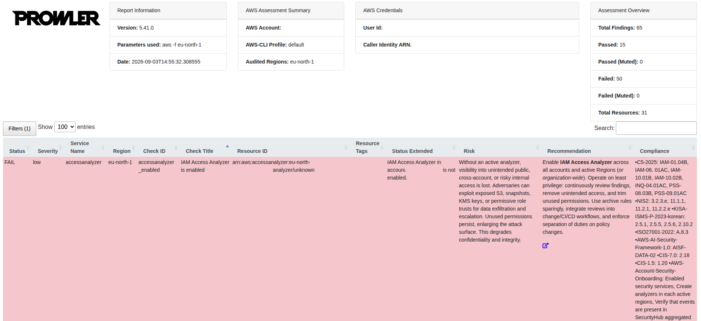
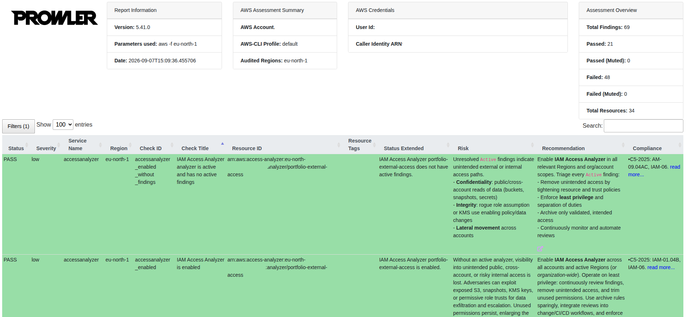

# AWS Cloud Security Assessment with Prowler

## 1. Overview

This project demonstrates an AWS cloud security assessment with Prowler.

I performed the assessment in a temporary AWS Free Tier account created for learning and security testing. The goal was not to eliminate every Prowler finding, but to practice a realistic security workflow:

**scan -> investigate -> assess risk -> remediate -> verify**

One of the relevant findings was related to IAM Access Analyzer. I investigated the finding, enabled Access Analyzer and ran Prowler again to verify the result.


## 2. Scope

The assessment focused on:

* AWS account and IAM security settings
* Prowler findings and recommendations
* security configuration
* one selected finding and its remediation

The environment was intentionally kept small to limit cost and unnecessary AWS services.

The assessment was performed in the `eu-north-1` region.


## 3. Initial finding

The initial Prowler scan was performed on **September 3, 2026**.

Target check:

`accessanalyzer_enabled`

Result:

**FAIL**

Prowler reported that IAM Access Analyzer was not enabled for the account in the region.

I selected this finding because Access Analyzer helps identify possible external access to AWS resources.


## 4. Investigation and decision

I first checked the AWS configuration to understand why the check was failing.

No active IAM Access Analyzer was configured for the account in the region.

I also reviewed the other Prowler findings. I did not try to fix every FAIL.

Some findings were:

* already satisfied by the existing configuration,
* not applicable to the environment,
* related to controls intended for larger environments,
* or not worth changing in this temporary learning account.

This helped me focus on changes that were relevant to the environment instead of simply trying to reduce the number of failed checks.


## 5. Remediation

I created an IAM Access Analyzer for external access analysis.

**Region:** eu-north-1
**Analyzer:** portfolio-external-access

I then waited for the analyzer to become active and complete its initial analysis.

No other security controls were changed as part of this remediation.


## 6. Verification

I ran Prowler again on **September 7, 2026**:

```bash
prowler aws -f eu-north-1
```

The targeted check changed from:

**FAIL -> PASS**

`accessanalyzer_enabled`

Prowler confirmed that the `portfolio-external-access` analyzer was enabled.

A related check also passed:

`accessanalyzer_enabled_without_findings`

This showed that the analyzer was active and had no active findings at the time of the second scan.


## 7. Before and after

Before:
`accessanalyzer_enabled` - FAIL

IAM Access Analyzer was not enabled in the assessed Region.

After:
`accessanalyzer_enabled` - PASS

IAM Access Analyzer `portfolio-external-access` was enabled.

The related `accessanalyzer_enabled_without_findings` check also passed.

The total number of Prowler findings was not used to measure the result because the two scans did not contain exactly the same resources and checks.

I used the Access Analyzer check as the main measure of the remediation.


## 8. Security decisions

I also had to decide **what not to change**.

I did not treat every Prowler FAIL as a problem that needed to be fixed.

For each finding, I considered whether it applied to this account, what risk it represented, whether a change was worth making, and whether the change could add unnecessary cost or complexity.

This was important because the goal was not to get a perfect Prowler score. The goal was to make a relevant security change and verify that it worked.


## 9. Evidence

The project contains selected evidence from the inital and verification scans.

### Initial scan - Access Analyzer not enabled



### Verification scan - Access Analyzer enabled



The original Prowler reports are not published because they contain account-specific AWS information


## 10. What I learned

This project helped me practice the process of using Prowler for an AWS security assessment.

Key takeaways:

* how Prowler can be used to check AWS security,
* how to investigate a security finding instead of fixing it blindly,
* how IAM Access Analyzer can help find unwanted access,
* how to make a security change and verify it,
* how to verify a security change with a second scan,
* and why scanner results need to be interpreted in the context of the environment.

The main result of this project was not a lower number of Prowler findings.

It was being able to take a security finding from **identification to verified remediation**.
